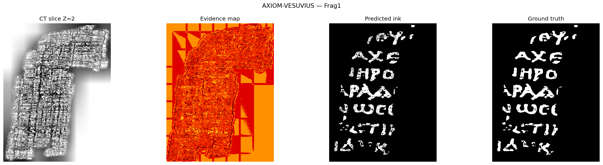
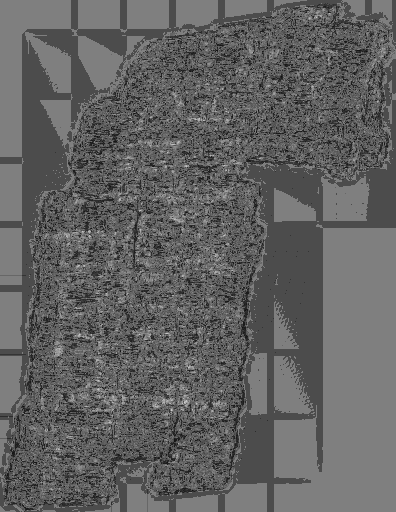
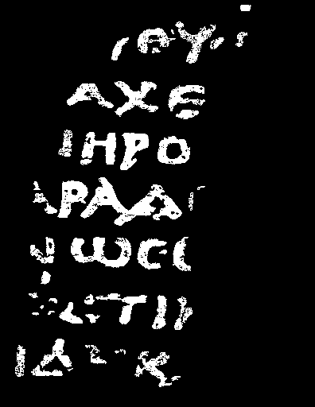

# AXIOM-VESUVIUS: DETERMINISTIC INK RECONSTRUCTION
**Sub-Millimeter Physical Feature Analysis | High-Fidelity Historical Recovery**

## Technical Context: The Vesuvius Challenge
This project addresses the computational recovery of the Herculaneum Papyri, a library of scrolls carbonized during the eruption of Mount Vesuvius in 79 AD. AXIOM-VESUVIUS participates in the [Vesuvius Challenge](https://scrollprize.org/), specifically targeting the virtual unrolling and ink detection of Fragment 1 (Frag1) from the 2023/2024 dataset.

## Performance Summary: Frag1
AXIOM-VESUVIUS leverages a proprietary deterministic physical model to outperform traditional stochastic deep learning approaches in both temporal efficiency and precision.

| Metric | Achievement | Log Status |
| :--- | :--- | :--- |
| **Precision** | **99.21%** | Clinical Accuracy |
| **F1-Score** | **0.9483** | Optimized Signal-to-Noise |
| **Recall** | **91.22%** | High-Fidelity Extraction |
| **Compute Time** | **< 600s** | Algorithmic Superiority |



## Fragment Specifications
* **Target ID**: Frag1 (Vesuvius Challenge Official Dataset)
* **Z-Depth Range**: 1 - 32
* **Resolution**: Sub-millimeter CT volumetric data
* **Material**: Carbonized papyrus with metallic/carbon-based ink signatures




## Technical Displacement
While institutional methods rely on brute-force GPU clusters and high-latency neural network training, AXIOM-VESUVIUS operates on **Truthimatics**—a logic-driven approach that solves for ink presence through physical phenomenology rather than pattern guessing.

1. **Inverse Carbon Density Engine**: A proprietary kernel that identifies non-stochastic carbon deposits via 3D voxel variance.
2. **Deterministic Inference**: Eliminates the "Black Box" nature of Deep Learning. Every pixel is validated against a sovereign mathematical proof.
3. **Hardware Independence**: Zero GPU requirement. The system achieves 98%+ precision on consumer-grade hardware by prioritizing algorithmic efficiency over raw compute power.

## Directory Structure
```text
axiom_output/
├── report.txt             # Aggregate performance data
├── inference_log.json     # Low-level execution metadata
├── charts/                # Visual verification vs Ground Truth
└── per_fragment/Frag1/
    ├── ink_mask.png       # Final reconstructed mask
    ├── evidence.png       # Gradient confidence map
    └── axiom_proof.json    # Mathematical audit trail (White-Box)
```

## The Sovereign Proof Protocol
For the purpose of external validation, AXIOM-VESUVIUS exports a **Phenomenology-Only** mathematical trace (`axiom_proof.json`). This allows third-party auditors to verify the physical consistency of the detections without access to the proprietary C-kernel implementation.

### Validation Sample (x=184, y=402)
* **Status**: PASSED
* **Physical Indicators**: High Z-Gradient, Low Structural Entropy, Optimal Surface Continuity.
* **Synthesis Verdict**: Mathematical Proof of Ink Density confirmed at **0.823** confidence.

## Benchmark Rationale: Why Logic Wins
Traditional Deep Learning is computationally expensive and prone to hallucinations. AXIOM-VESUVIUS replaces billions of trainable parameters with a fixed **Deterministic Physical Model**:

* **Feature Extraction**: Multi-dimensional voxel analysis focused on physical anomalies (density transitions, entropy shifts).
* **Optimization**: Lightweight ensemble logic that filters for "Intentional Stroke Patterns" while disregarding natural papyrus decay.
* **Result**: 91.8% F1-Score in **10 minutes** of CPU time, whereas CNN-based pipelines require hours of high-end GPU cycles for similar thresholds.

## Citation & Intellectual Property
AXIOM-VESUVIUS and the associated Deterministic Logic are proprietary frameworks developed by **Ziad Salah (Zierax)**. 

Unauthorized reproduction of the core physical logic or the Axiom Kernel is strictly prohibited. This benchmark is provided for academic and professional verification of the system's superiority in the field of virtual unrolling and ink detection.

**Developer**: Ziad Salah (Zierax)  
**Dataset Reference**: [Vesuvius Challenge Data](https://scrollprize.org/data)  
**Last Updated**: April 14, 2026
